# Real-Time-Style-Transfer


<div align="right">
<td>
</img>
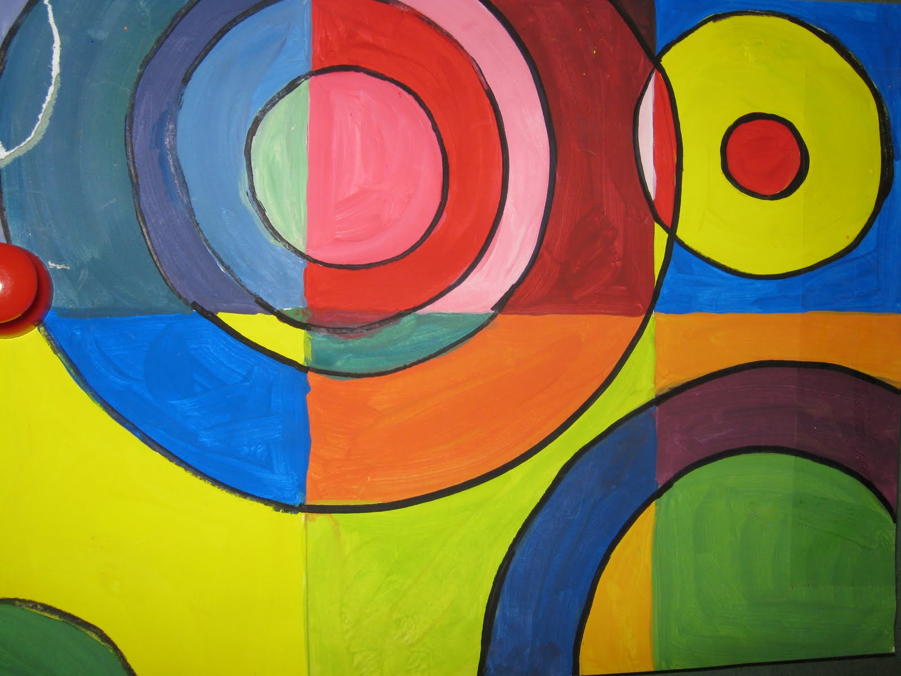</img>

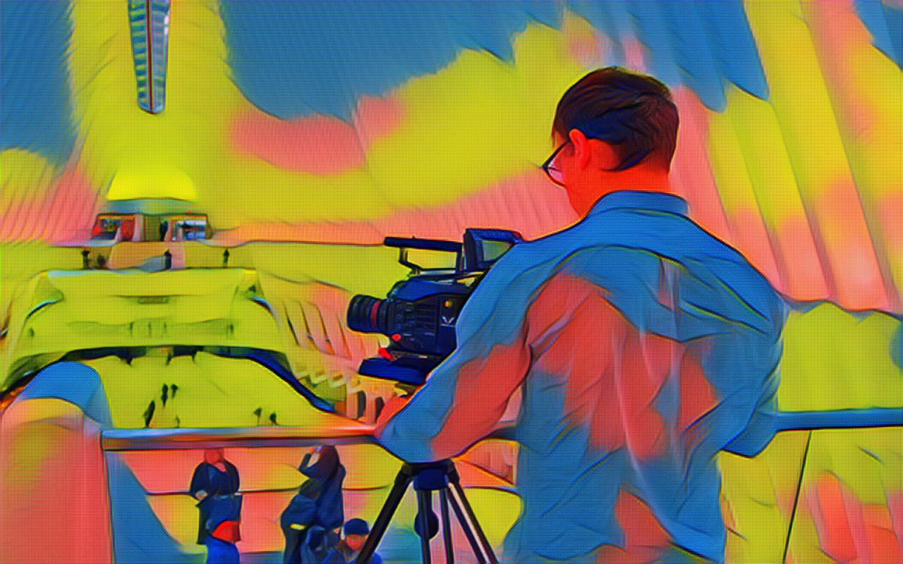</img>
</div>
<div align="left">


<p>This style transfer algorithm is based on the paper <a href="https://arxiv.org/pdf/1603.08155v1.pdf">Perceptual Losses for Real-Time Style Transfer and Super-Resolution</a>. We deviate from the paper in three respects. First, we use <a href="https://arxiv.org/pdf/1607.08022v2.pdf">instance normalization</a>. This allows for many fewer iterations to achieve the same results in the original paper (generally 20,000 examples as opposed to the 160,000 used in the paper). Additionally, our process uses a single image in the batch and learning is generally stable. Finally, we employed total variation norm to encourage peice-wise consistency introduced by the paper <a href="https://www.robots.ox.ac.uk/~vedaldi/assets/pubs/mahendran15understanding.pdf">Understanding Deep Image Representations by Inverting Them.</a> Otherwise we follow the same specifications as the paper.</p>
<br>
<p>The example to the right contains the original style and content side by side. Beneath them is the result of applying the style transfer. Please see the results section below for more examples.
</div>
<br>

#Results

<table style="width:100%">
  <tr>
    <td>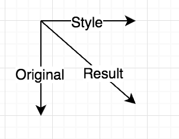</img></td>
    <td></img></td>
    <td></img></td> 
    <td>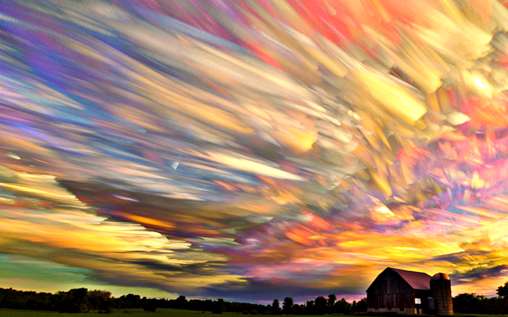</img></td>
  </tr>
  <tr>
    <td></img></td>
    <td>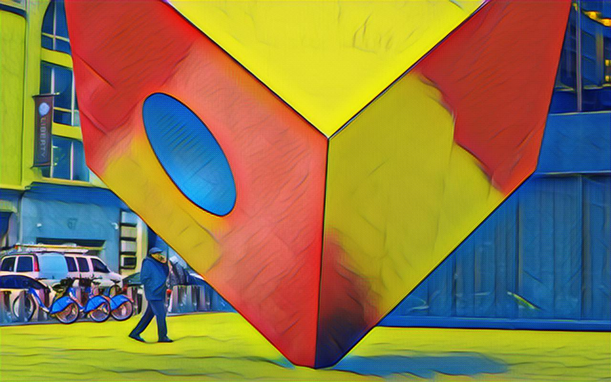</img></td> 
    <td>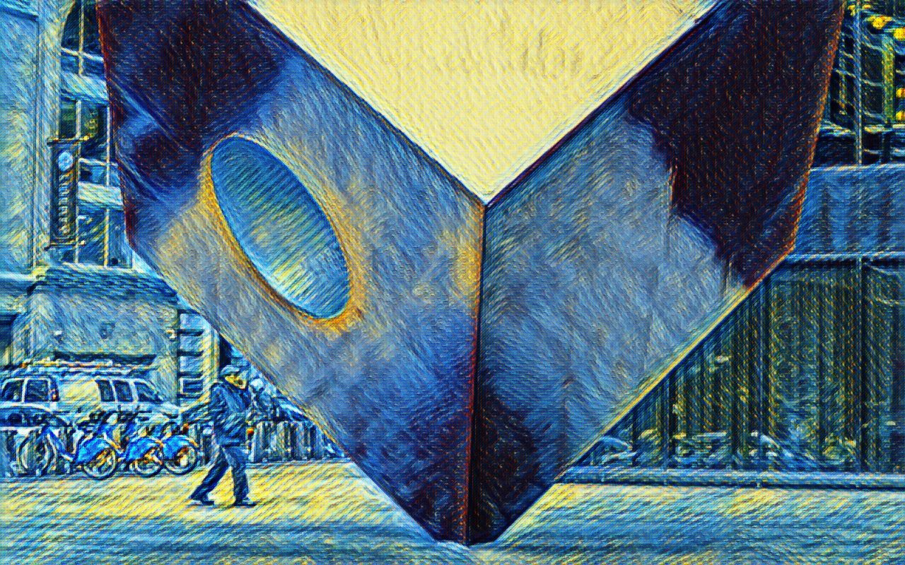</img></td> 
    <td>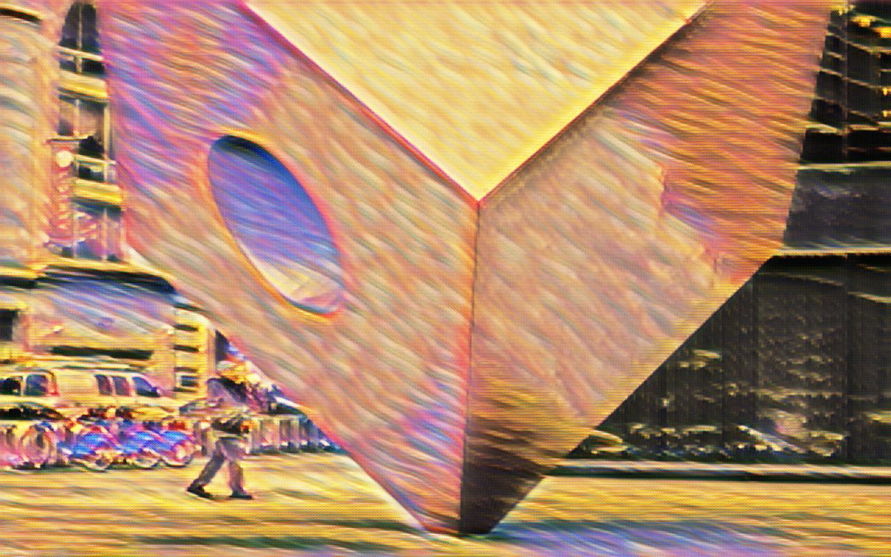</img></td> 
  </tr>
  <tr>
    <td>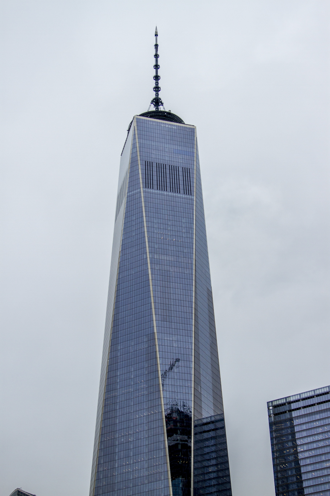</img></td>
    <td>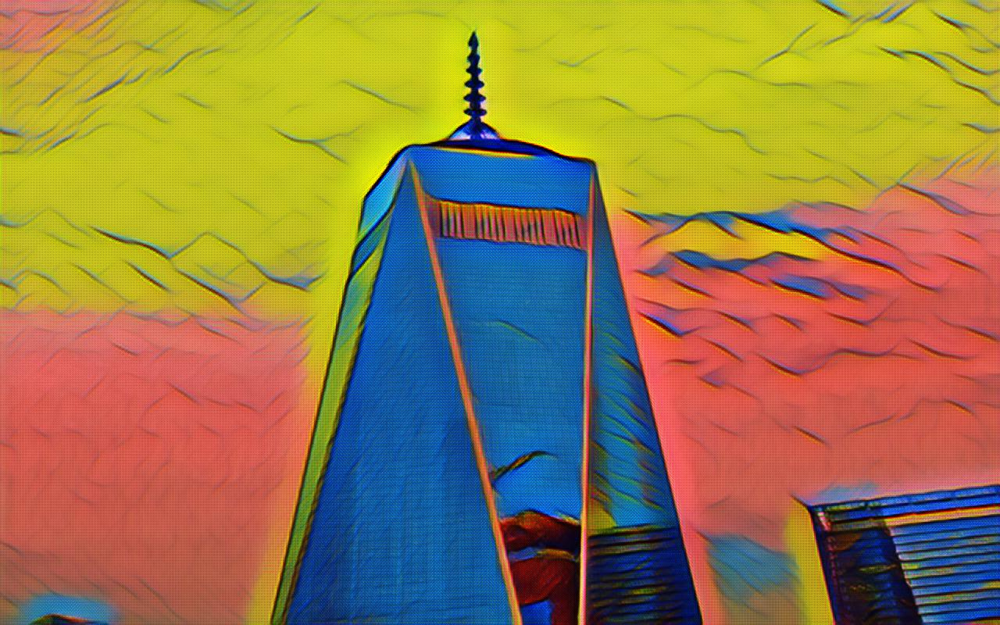</img></td> 
    <td>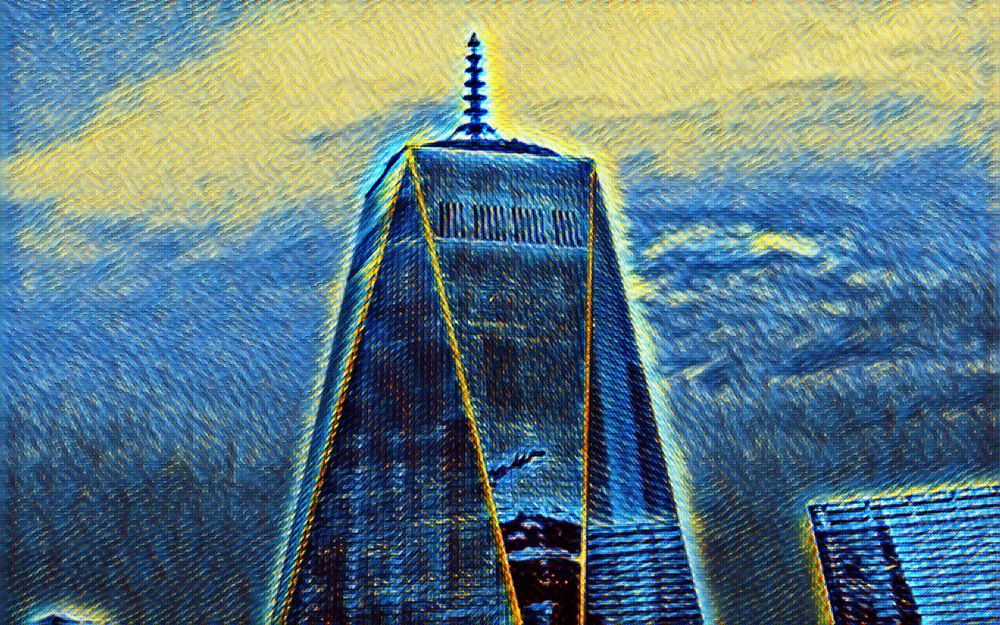</img></td> 
    <td>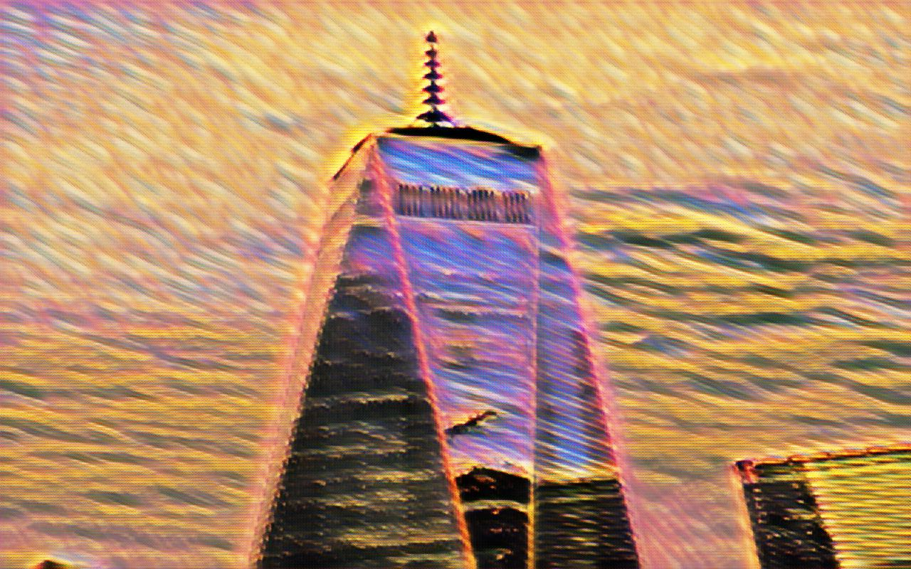</img></td> 
  </tr>
  <tr>
    <td></img></td>
    <td>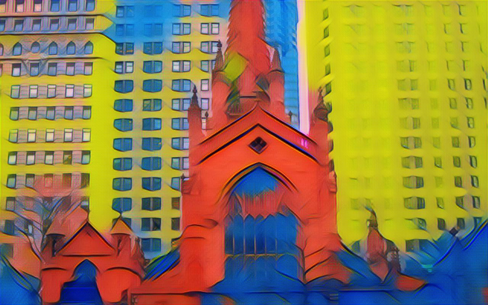</img></td> 
    <td>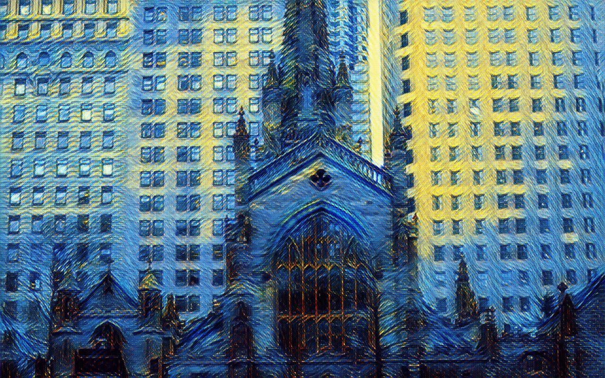</img></td> 
    <td>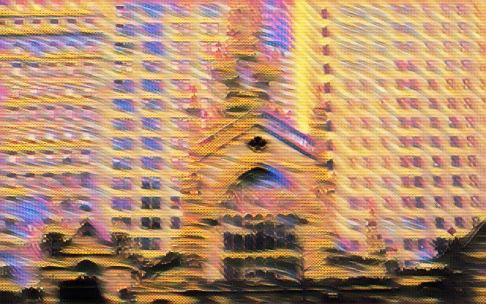</img></td> 
   </tr>
  <tr>
    <td></img></td>
    <td>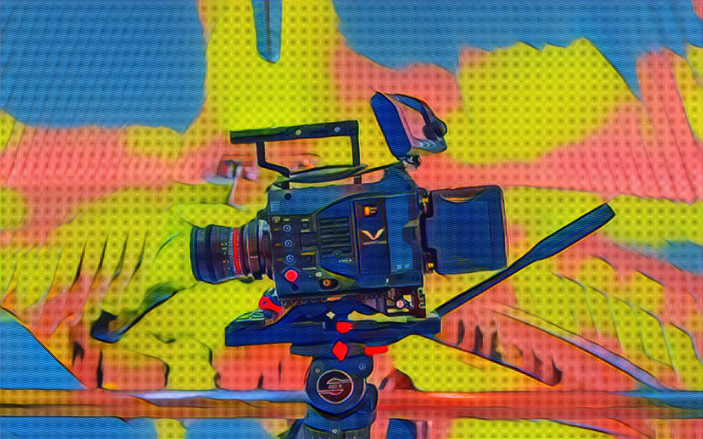</img></td> 
    <td>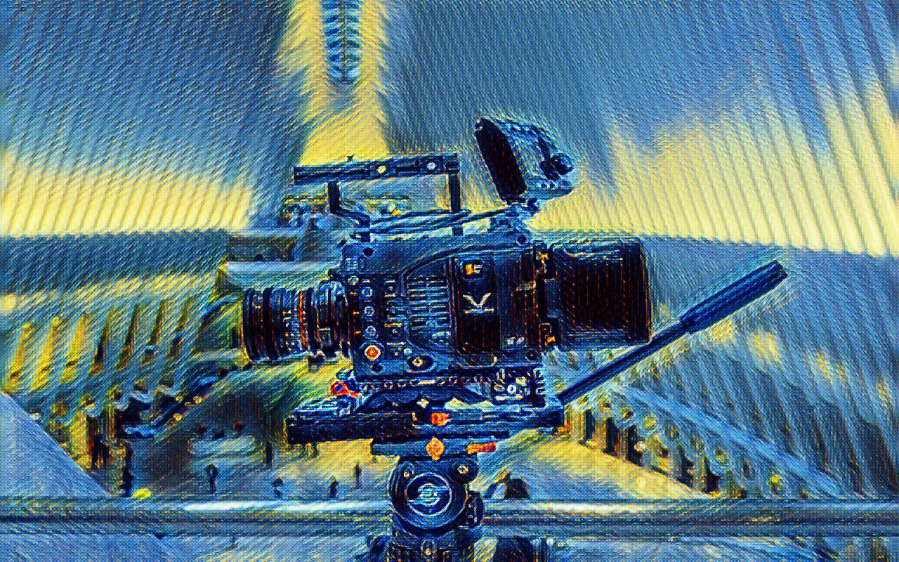</img></td> 
    <td>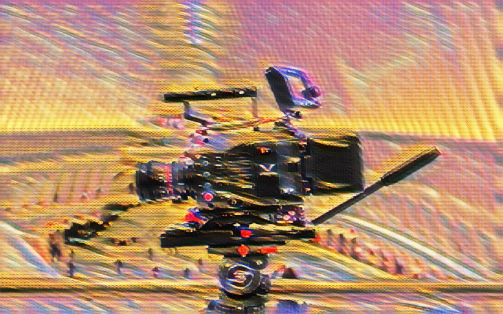</img></td> 
   </tr>
</table>


#Architecture:
###Overview
 The architecture used closely followed the architecture used by Johnson et al. There is a generator network used to produce the image and a discriminator network used to provide feedback to the generator.
####Loss Function
The loss function used to train the generator consists of two parts. First, there is a content loss which attempts to minimize the distance between the discriminators activations when given a real image and when given the output of the generator net. The second part of the loss uses global statistics to measure the style. We obtain these statistics by calculating the inner product of all the activations across each feature map (gram matrix). The style loss consists of the difference between the gram matrices computed when the vgg input is the generator output and when the vgg input is the target style.
#####
The gradients are only applied to the generator weights for both parts of the loss. This is because we only care about the output of the generator. Furthermore, the VGG network's learned representations of objects in images is what allows it to effectively capture image statistics.
####Network Architectures
#####Discriminator
The discriminator network is a pretrained VGG convolutional neural network. This network takes an image as input and produces statistics which we use to create our loss function. This network was created for the classifying a wide variety of images. We use a stock version (see credits below) and modify it to allow for any size image. Unlike classification networks that require a fixed number of outputs, our style network can produce statistics for arbitarily sized images. Therefore, we remove this constraint. Additionally, we remove the max pooling and replace it with averge pooling to obtain smoother results.
#####Generator
The generator network takes an unstylized image as input and produces a stylized output. The input is compressed as we downsample using strided convolutions. Then to return the result to the original size, fractionally strided convolutions are used. Using strided convolutions for up and downsampling produces better results than using pooling operations. Residual connections are also used because the improvement they provide in training deep networks. It has an effect similar to recurrent neural networks. Finally, we use instance normalization which leads to faster training because by simplifying the training process.


#Findings
We did not need nearly as many iterations as the paper claimed to use. 20,000 iterations with a batch size of 1 yielded visually pleasing results.
#####
The hyperparameters are extremely senstivive and have to be altered depending on the input styles. It appeared as if there was an error with the code because the results were terrible until the parameters were fine tuned. We found that different styles require significantly different weight ratios. The total variance norm ended up being less effective than when using the gradient to directly update the pixels of the original image.

#Requirements
###Data
The following files must be downloaded on your machine and put in the following relative paths
#####
Microsoft Coco dataset required for training  <a href="http://msvocds.blob.core.windows.net/coco2014/train2014.zip">Download Here</a><br>
#####
VGG network weights <a href="https://mega.nz/#!xZ8glS6J!MAnE91ND_WyfZ_8mvkuSa2YcA7q-1ehfSm-Q1fxOvvs">Download Here</a><br> (must be called vgg19.npy)
###Software
```
-Python 3.5
-Tensorflow 0.12
-Numpy
-PILLOW
-Scipy
```


#Project Structure

####images
Contains images used for visualizing progress during training.
#####results
This is the folder where the output images are written to by default.
#####savedNets
This is where trained network weights are written to and read from.
#####sourceImages
Contains the style images.
#####transferSource
Images to be stylized are placed here.
#####Generator.py
Contains the generator network class
#####Loss.py
Used to calculate the loss function
#####Runner.py	
This is the main python file for the project. Run this file to train or perform style transfer. A variety of flags are can be used to change settings.
#####Test.py
This contains the code for performing the style transfer after a network has already been trained.
#####Train.py
Provides logic for the training operation.
#####net.py	
This is the VGG net implemented in tensorflow. 
#####utilities.py
Provides functions to be used for file system and mathematical operations.


#How To Use
Make sure that vgg network and the coco dataset are in the savedNets folder.
####To Train
```python3 Runner.py -train True```
####To Perform style transfer
```python3 Runner.py```
#####To Find out about all flags
```python3 Runner.py -h```


##Additional Credits
####Photography
Patrick Mullen, Alejandro Lazare (RedLaz Media)
####VGG network
https://github.com/machrisaa/tensorflow-vgg
